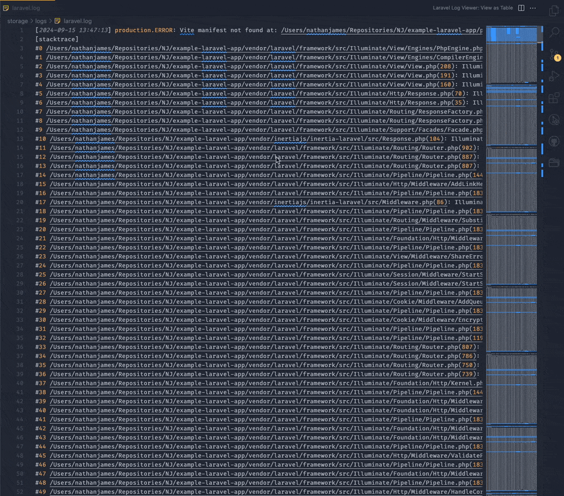

# Laravel Log Viewer

View your Laravel Logs in a easy-to-read table, with filters and pagination.

## Features

- Find and list your `.log` files automatically and open them directly in a table.
- Easy to navigate table, with pagination and filters to search on date, severity and message
- ...more to come (make an issue if you have a request!)

### A button (and command) to open when you are in a `.log` file:

### A command to search and find all .log files in your Workspace, and open any of them into the table:

## Extension Settings

Currently there are no setting to configure.

## Known Issues

No known issues. This extension is new, so please create an issue if you encounter any issues, or have any feedback!

## Future Plans

- Add support for any regex pattern, not just Laravel Logs.
- Advanced searching/filtering on the log.
- Better pagination (eg. add 'First' and 'Last').
- Allow click-through to the file in a log message.
- Add a 'Per Page' option.
- ...any suggestions made on GitHub (make an issue if you have a request!)

## Release Notes

### 0.1.1

- Fix README gifs not loading

### 0.1.0

- Added a second command which finds you `.log` files for you and let's you open any of them.
- Added menu button when in `.log` file to open the log as a table.
- Styling updates for better handling of expanding a log message.
- Option to view expanded log message wrapped or unwrapped.
- Copy to clipboard button.

### 0.0.1

Initial release of the extension. Command to open a laravel .log file in a table format.

---
